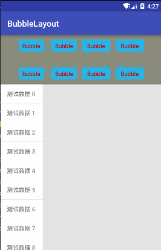

# BubbleLayout
 

## gradle:
```groovy
dependencies {
    ...
    compile 'sing.bubblelayout:library:1.0.1'
}
```
## Maven:
```xml
<dependency>
　　<groupId>sing.bubblelayout</groupId>
　　<artifactId>library</artifactId>
　　<version>1.0.1</version>
　　<type>pom</type>
</dependency>
```

## Attributes 

| attr | description |
|:---|:---|
| arrowWidth | Width of the arrow, default 8dp |
| arrowHeight | Height of the arrow, default 8dp |
| arrowPosition | Position of the arrow, default 12dp |
| cornersRadius | Corner radius of the BubbleLayout, default 0dp |
| bubbleColor | Color of the BubbleLayout, default WHITE |
| strokeWidth | Width of the stroke, default 0dp |
| strokeColor | Color of the stroke, default GLAY |
| arrowDirection | Drawing position of the arrow : 'left' or 'top' or 'right' or 'bottom', default 'left' |


## Samples
```xml
<sing.BubbleLayout
    android:layout_width="70dp"
    android:layout_height="30dp"
    android:padding="5dp"
    app:arrowDirection="right"
    app:arrowHeight="8dp"
    app:arrowPosition="5dp"
    app:arrowWidth="8dp"
    app:bubbleColor="@android:color/holo_blue_light"
    app:cornersRadius="6dp"
    app:strokeWidth="1dp">

    <TextView
        android:layout_width="wrap_content"
        android:layout_height="wrap_content"
        android:layout_gravity="center"
        android:text="Bubble"
        android:textColor="@android:color/holo_red_dark" />
</sing.BubbleLayout>
```
## 图示菜单
####核心代码：
```JAVA
bubbleLayout = (BubbleLayout) LayoutInflater.from(this).inflate(R.layout.layout_sample_popup, null);
bubbleLayout.measure(0, 0);// 猜猜有什么作用
popupWindow = BubblePopupHelper.create(this, bubbleLayout);
```
普通的recyclerView，在点击事件中如下：

```JAVA
recyclerView.scrollToPosition(position);

v.getLocationInWindow(location);
recyclerView.getLocationInWindow(recyclerViewLocation);

// 三角距离item顶端的距离
float hornToItemTop = v.getHeight()/2 - bubbleLayout.getArrowHeight()/2;
// 弹出框高出Item的距离
int higherDistance = (bubbleLayout.getMeasuredHeight() - v.getHeight()) / 2;
// 弹出框的y轴顶部坐标
int bubbleLayoutTop = location[1] - higherDistance;
// 弹出框的y轴底部部坐标
int bubbleLayoutBottom = bubbleLayoutTop + bubbleLayout.getMeasuredHeight();

int aaa = location[1]- higherDistance;
if (aaa < recyclerViewLocation[1]){// 弹出框超过了顶部
    bubbleLayoutTop = recyclerViewLocation[1];
}

if (bubbleLayoutBottom > screenY){
    bubbleLayoutTop = screenY - bubbleLayout.getMeasuredHeight();
}

if (location[1] < recyclerViewLocation[1]){
    location[1] = recyclerViewLocation[1];
}
if (location[1] > screenY - v.getHeight()){
    location[1] = screenY - v.getHeight();
}

bubbleLayout.setArrowPosition(location[1] - bubbleLayoutTop + hornToItemTop);
popupWindow.showAtLocation(v, Gravity.NO_GRAVITY, v.getWidth(), bubbleLayoutTop);
```
其中

```JAVA
private int[] recyclerViewLocation = new int[2];// recyclerView的坐标
private int[] location = new int[2];//点击的Item的坐标
private int screenY = 0;// 屏幕高度
```

------End---------------------------------------------